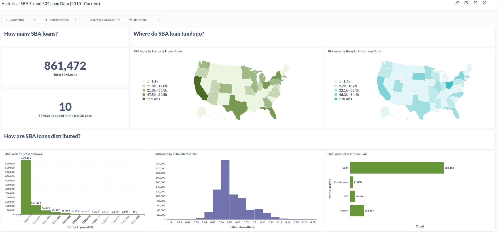

<p align="center">
  
</p>

<h1 align="center">Loan Origination System</h1>
<h2 align="center">Community Edition (CE)</h2>
<p align="center"><em>OpnLend CE software is a product of OpnLend, Inc.</em></p>
<p align="center"><em>OpnLend Inc. is an Indiana registered S-Corporation</em></p>
<p align="center"><em>Inquires regarding the OpnLend proprietary edition may be directed to OpnLend Inc.'s sole beneficial owner, Tucker Thomas Olson: tuckerolson13@gmail.com</em></p>
<p align="center"><em>OpnLend's base package (all packages currently seen here) allow for internal modifications to the source code. However, are subject to a custom license and terms of use.</em></p>

### No-Nonsense, Privacy Focused Approach
Do you desire to no longer have to send your customers' data to a remote server owned and operated by someone else? With OpnLend CE, you can deploy a loan origination system locally over your LAN connection.

### Placing Your Needs First, As It Should Be
Don't need a module? Remove it. Integration of other AGPL v3 compatible solutions is encouraged. My OpnLend solution is ***intended for your institution to scale based upon on its needs; not the needs of other institutions***. Ultimately, helping you more efficiently lend to businesses of all sizes, farmers, real estate investors, and others to build a better economy.

### Additional Premium Features Offered
Paid, premium features include, but are not limited to: cloud hosting, customer support, custom proprietary solutions, in-house system training, remote system training, basic credit analysis training, intermediate credit analysis training, advanced credit analysis training, and expert credit analysis training.

## Tucker, why the free community edition?
- I'm tired of having to "recreate the wheel" at each financial institution worked at.
- During the last decade, I've worked in Commercial Underwriting or Credit Analytical roles at various financial institutions. Subsequently, I've had the privledge to use various different loan origination systems. I've seen what works, and what doesn't work.
- From what I've witnessed, there is very little to no innovation being done. The features offered by loan origination system providers are technologies that other industries have been utilizing for years.  In some cases, technologies I've been deploying in my home automation system for years. My point is, banking has historically been slow to adopt new technologies.
- Most bank and credit unions in the United States are small. Often times, the loan origination systems offered by these 'big players' are overkill for the financial institutions actual needs.
- Releasing this free community edition provides a new 'baseline' of basic features that all lenders should have in their toolbox.

## Global Relationships
The Global Relationships app serves two primary purposes:
- The CRUD-based UI serves as a "mini-CRM" for Business and Personal Account Information.
- The Global Relationship ID is a Unique ID that can be shared among one or more Business or Personal Accounts. Per FDIC, NCUA, and SBA (Size Standard) requirements, it aggregates related accounts.

## Dashboard: Embedded Business Intelligence Solution
Each institution can embedd whichever Business Intelligence product it chooses. Metabase's Business Intelligence solution will be an installation option for those who may not have an existing Business Intelligence solution or may be exploring alternative solutios. 

**What is Metabase?** [Metabase](https://github.com/metabase/metabase) is open-source business intelligence tool that enables users to explore, visualize, and share data insights without the need for extensive technical knowledge. It allows for easy querying through a user-friendly interface, making it accessible for users to generate reports and dashboards from their data sources. Here is an early example of a dashboard using Metabase:



To use Metabase as the dashboard front-end, [Docker](https://github.com/docker) is required for installation. In my home development environment, I am running Debian 11 within a Proxmox LXC. If using a similar setup or Debian-based system, here's how to install Metabase using Docker:

- Ensure Docker is installed on your system. For Debian-based systems:
  ```sh
  apt-get update
  apt-get install apt-transport-https ca-certificates curl gnupg lsb-release
  curl -fsSL https://download.docker.com/linux/debian/gpg | gpg --dearmor -o /usr/share/keyrings/docker-archive-keyring.gpg
  echo "deb [arch=$(dpkg --print-architecture) signed-by=/usr/share/keyrings/docker-archive-keyring.gpg] https://download.docker.com/linux/debian $(lsb_release -cs) stable" | tee /etc/apt/sources.list.d/docker.list > /dev/null
  apt-get update
  apt-get install docker-ce docker-ce-cli containerd.io

- Pull latest Metabase image from Docker and run Metabase:
  ```sh
  docker pull metabase/metabase:latest
  docker run -d -p 3000:3000 --name metabase metabase/metabase # Replace Port '3000' with Different Port if Desired
  
- Install PyJWT for Embedding Metabase Dashboard into Webpage:
  ```sh
  pip install PyJWT

- Please reference the views.py file and the Dashboard.html file within the Dashboard app for an example of how to complete the embedding process. 

## Financials
The Financials app is the financial spreading and modeling software for spreading business financials, personal tax returns, personal financial statements, and debt schedules for business and personal accounts.
### Purpose
- Build a financial spreading app within my OpnLend web (Django) application, with a focus on credit analysis.
- Provide generic spreading statements that allow for core functionality, while allowing users to build their own custom sub-statements that are either separate from the “core” generic models or derivatives of those models.
- The generic model will be primarily based upon the United States IRS Form 1120 and 1065. This will allow for consistency when, at a later date, implementing automated spreading functionality.

### Database Design
- A given set (Income Statement and Balance Sheet) of financial statements are grouped together by the “parent” Financial Manager Primary Key.
- In addition to the key fields to form relationships between the Financial Manager and the “child” Income Statement and Balance Sheet tables, the Financial Manager is to store the Business Entity’s Unique Identifier, Statement Date, Period Length, Statement Type (CPA Reviewed, Tax Return, Company Prepared, etc.), Accounting Method, among potential other fields.
- Additional Financial Statements Offered: Additional database tables where a given record’s dated statement can reconcile to the other “child statements” of the Financial Manager’s primary key record. Examples include the following: Accounts Receivable Aging Summary, Accounts Payable Aging Summary, Inventory Summary Report, Invoices, etc.

### Database Fields: Subtotal, Generic, and Custom (JSON)
- Each parent account has an initially hidden “_generic” child account, that any value entered into the parent account is stored in; allowing the parent account to continue to aggregate its children account(s).
- The generic account is only revealed if the user opts to spread child accounts; opting by selecting a “+” sign or some other form of indication to add child accounts.
- Infinite addition of entity-specific child accounts allowed via JavaScript, with aggregation to the "parent" subtotal account.
- The subtotal accounts are solely front-end visual representations allowing for easier data entry. Their values are not to be stored within the database; reducing redundancy.

## Loans
### Primary Design
- New Loan Requests, which exist for the purpose of underwriting new money requests. If integration of existing loans exists, allows for the ability for the auto-merging of approved, funded loans from the New Loan Requests table to the Existing Loans table.
- Existing Loans, allowing for portfolio management, loan renewals, loan reviews, modifications, change of terms, etc.

### Primary Loan (Structure) Details
- Stores the (temporary) New Loan Request Account Number or the existing Account Number if within the Existing Loans table.
- Additional Primary Structure fields include, but are not limited to: Loan Amount, Loan Product, Loan Term, Loan Amortization (if applicable depending on chosen Loan Product), and various Pricing Terms.

### Loan Roles Foreign Key Relationship
- Loan Roles: Defines Borrower, Co-Borrower(s), and Guarantors.
- Additional fields include Guaranty Indebtedness (i.e., unlimited vs limited; if limited, dollar amount or percentage of commitment) and Guaranty Security (collateral pledged).

### Loan Collateral Schedule Foreign Key Relationship
- Allows for the assignment of Collateral from the available 'Collateral Pool'.

### Loan Ticklers
- Document reporting requirements assigned at the loan level.

### Loan Fees / Vendor Management
- Assigns individual loan fees, including the ability to import directly from Vendor Management (i.e., ordering appraisals, environmental due diligence, etc.)

### Loan's Sources of Repayment
- Detailed description to be added at a later date....

### Loan Risk Rating
- Detailed description to be added at a later date....

## Deposits
Detailed description to be added at a later date....

## Loan Applications
Initial design is to include:
- Build-an-Application Module: Will allow for an institution to quickly build an online loan application that will automatically sync to a 'New Money Request' within the 'Loan' app.
- SBA 7a Application Web Forms: Will include API configuration per the publicly available API documents from the SBA.
- SBA 504 Web Forms: Will include API configuration per the publicly available API documents from the SBA.
- USDA FSA Web Forms: I need to reserach whether an API is available.

## Portfolio Management
Detailed description to be added at a later date....

## Document Portal
I may integrate an existing open source document management solution as an optional download, as financial institutions may prefer to have their documents stored on their existing primary source of retention.


## Additional General Design Definitions to be Added Later
