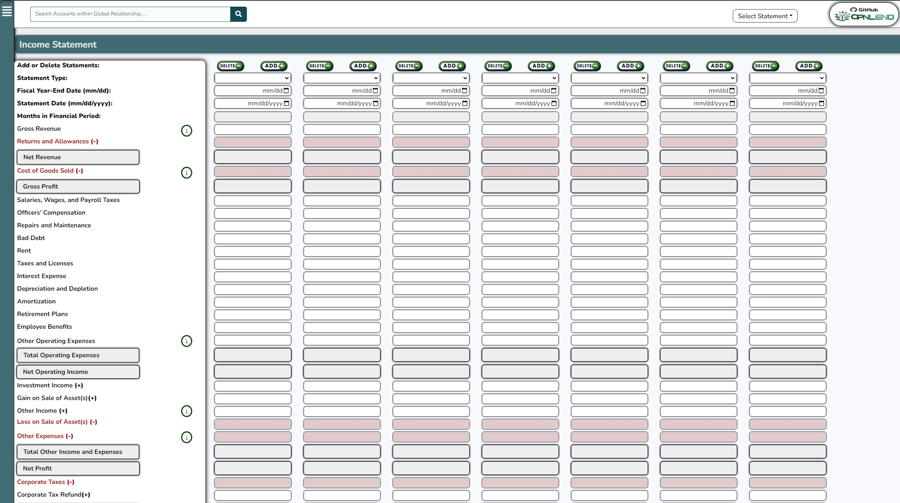

**_*Update 12/19/2023: In the spirity of transparency, I've uploaded some initial files. Once I have published the Alpha release of the financial spreading portion of the application, I'll begin updating this repository with my documented plan. I am performing some bug cleanup at the moment (benefits of having 10+ years of experience and testing own product!) and then I would like to implement the database saving functionality and export to CSV and JSON functionality before publishing the Alpha release. *_**

**_*Update 12/17/2023: I've been working on the dynamic financial spreading front-end for the last two weeks and am nearing completion. Once completed, I'll update the files within this repository. In the meantime, if you are interested, you can test the functionality of the spreading model while keeping in mind that it is incomplete and contains bugs that will be resovled soon. That model can be accessed here: https://credit.opnlend.com/Financials/ *_**

**_An open source, modular loan origination system. Initially designed for commercial loan origination, including SBA and USDA loans, while allowing for consumer loan origination moduels to be developed at a later date._**

The intent of this project is an "ala carte" approach. The "core apps" are intended to be Loans, Relationships, and Spreading. Each additional app is to be individually installed to the individual or institution's needs (Deposits, Collateral, Profiles, etc.). Later down the road, possibly adding support for the installation of "Third Party Plugins" for community made content (data visualization packages, support for credit reporting agency data pulls, analysis tools, etc.). Furthermore, it is to be locally hosted; mitigating risk of downtime when compared to a 3rd party cloud server, as well as third-party data goverance risk mitigation. With this utilizing Django as the backend, additional security risk mitgatoin is offered when compared to Excel-based models. I am currently developing this within a Djano container (LXC) hosted on my Proxmox home server, integrated with my PostgreSQL database hosted in a separate LXC. I'll likely integrate the relational database solution within the web-hosted application as an option during the installation process, while providing the ability for an institution to opt to integrate their own database soluition. To handle dynamic field creation, the database solution used will require support for JSON fields.

**Background: Commercial Credit Experience (~10 years) and Loan Origination System (LOS) experience.**

I'm in the very beginning stages, including planning and design. While I have been working in commercial credit/underwriting for the last decade, outside of experience with VBA, my experience in coding and databases is beginner to intermediate. Though, am learning more quick than I ever have before thanks to AI tools.

I have experience utilizing various different loan origination systems (Fusion Credit Quest, Abrigo Sageworks, nCino, and others), collaborated with LOS engineers when improving financial institutions' existing integrations, developed various auto filled templates to improve efficiencies, and most recently worked at a FinTech assistig with the micro-loan automated decisioning process. Lastly, using VBA and Microsoft UserForms, along with Microsoft Acccess as an SQL database solution, I've developed simple loan origination systems with the underlying intent on automating redudant tasks. That system inclusive of automated credit memo generation, automated spreading of PDF form fields, and other features more commonly found in (expensive) loan origination systems.

I'm more so using this application as a learning project to continue learning coding while applying my professional commercial credit experience.
